# **Kubernetes Ingress**

Ingress is a Kubernetes resource that allows external traffic to enter a Kubernetes cluster. This external traffic can be via HTTP or HTTPS to a service running inside the cluster. The service is exposed through the Ingress to allow incoming traffic. Traffic routing is controlled by rules defined in the Ingress resource.

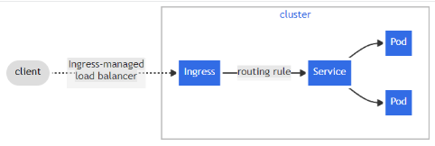

## **Ingress Controllers**

Ingress controllers in Kubernetes are components that receive traffic from the internet and distribute the load evenly across applications. An Ingress controller is a daemon (a background service process that monitors the system or provides functionality to other processes) that runs inside a Pod and watches the Ingress endpoint.

When a new endpoint is created, the daemon uses the configured set of rules to allow traffic to reach a service. An Ingress controller handles traffic entering and leaving the cluster based on these Ingress rules.

There are many [Ingress controllers available](https://kubernetes.io/docs/concepts/services-networking/ingress-controllers/).

In the following example, we will focus on **NGINX Ingress controllers** as they are among the most commonly used. NGINX is a web server that can also be used as a reverse proxy, load balancer, mail proxy, and HTTP cache.

**NGINX Ingress Controller Implementation Example**

We add an NGINX ingress controller for MicroK8s with the following command:

``` 
microk8s enable ingress
```

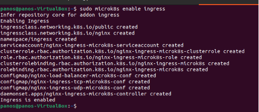

This deploys a pod for the Ingress controller and we can run the following command to see this pod: 

```
kubectl get pods -A | grep ingress
```
This shows that the Ingress controller is running


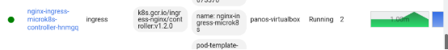


**Application Deployment** (**NGINX web server**)

The application is deployed with the following command:

```
microk8s kubectl run myapp --image=nginx
```

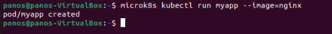

This creates a pod called myapp with nginx as the container image. Next, we connect Ingress so that traffic is routed correctly to the pod. To do this, we need a NodePort Service that exposes a port for the application.

```
microk8s kubectl expose pod myapp --port=80 --name myapp-service --**type**=NodePort
```

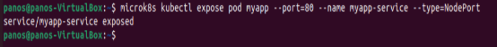

With the command: ```microk8s kubectl get svc | grep myapp-service```

we can see more information about the service.

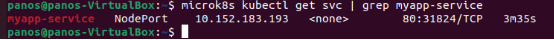

We can access the application at: http://10.152.183.193

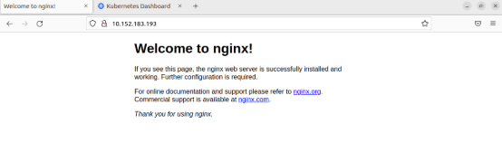

Now we have created an application (nginx) running locally on our computer and an Ingress controller which are not connected to each other. To prevent users from accessing the cluster IP and to provide security we need to connect the Ingress controller to the application. Giving the application a domain name will ensure that even if we redeploy the Kubernetes cluster to a different set of IP addresses, the application will be available.

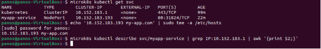

Then we create a file named ingress.yaml with the following code.

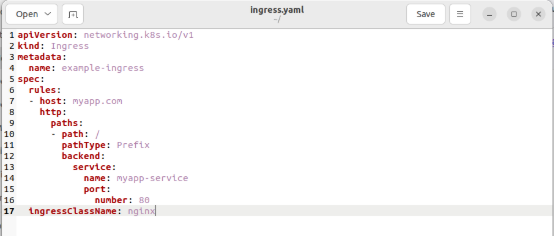

And we deploy it with the following command: ```microk8s kubectl apply -f ingress.yalm```

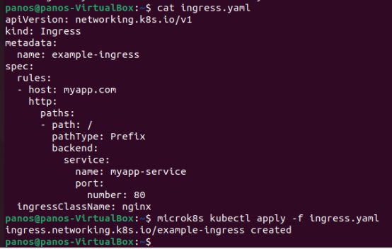

With the above command cat ingress.yaml we can see the content of the file.

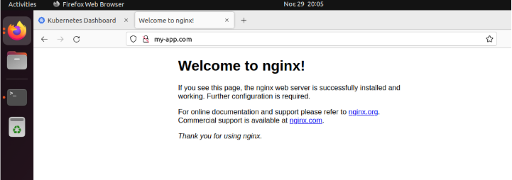
We can visit the application at: http://my-app.com
